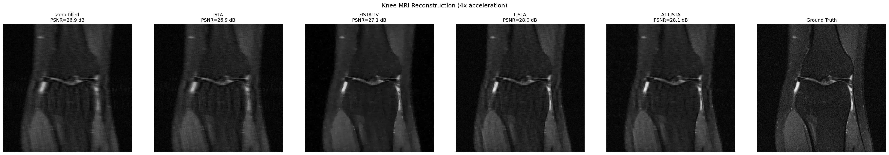
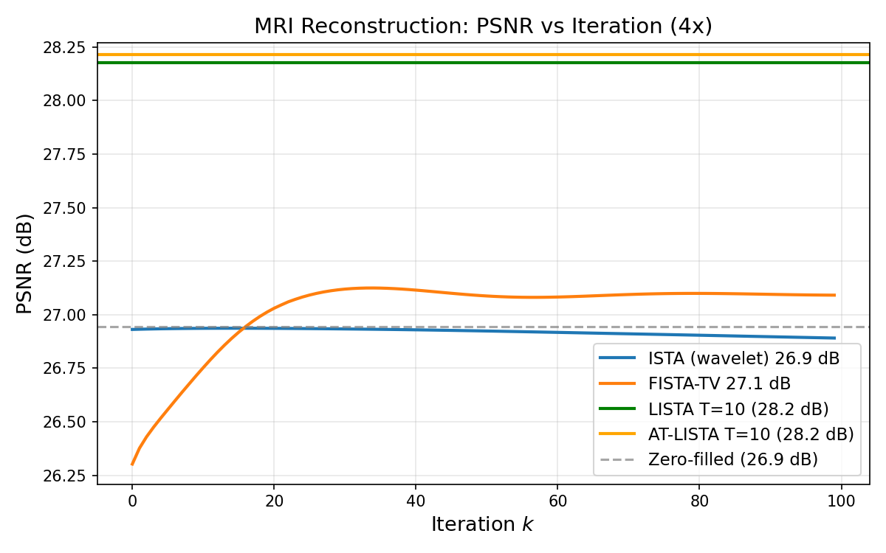
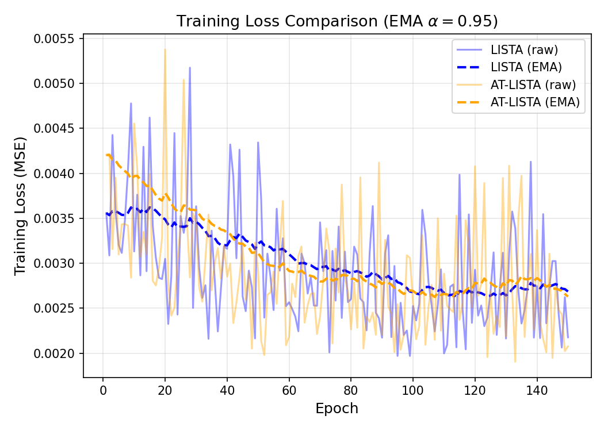

# Algorithm Unrolling for MRI Reconstruction

Final project for MATH 7503. We compare classical iterative methods with learned unrolling approaches on the fastMRI knee dataset (4× acceleration).

## Methods

- **Zero-filled** — baseline
- **ISTA** — iterative shrinkage-thresholding (wavelet)
- **FISTA-TV** — accelerated ISTA with total variation
- **LISTA** — learned unrolled ISTA (T=10 layers)
- **AT-LISTA** — attention-enhanced LISTA

## Results

| Method | PSNR (dB) | SSIM |
|--------|-----------|------|
| Zero-filled | 26.94 | 0.5525 |
| ISTA (wavelet) | 26.89 | 0.5409 |
| FISTA-TV | 27.09 | 0.4430 |
| LISTA (CNN) | 28.18 | 0.5618 |
| **AT-LISTA** | **28.21** | **0.5662** |

Learned unrolling (LISTA/AT-LISTA) outperforms classical methods by ~1.3 dB PSNR. AT-LISTA achieves the best performance on both metrics.

## Figures

